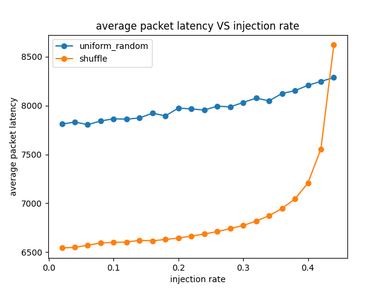
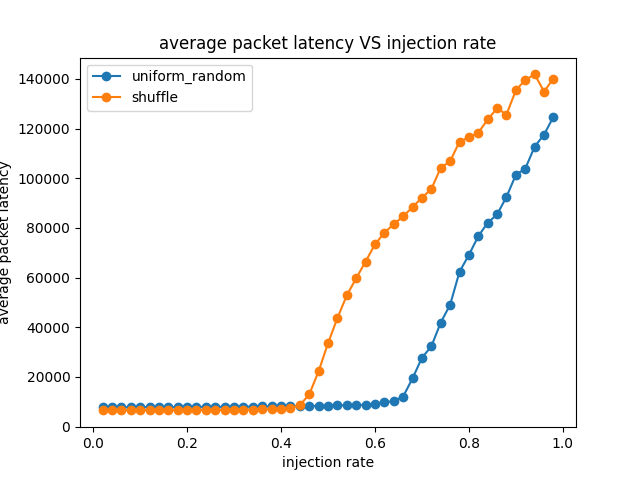

# Running Synthetic Traffic through a Network

## Uniform Random Traffic
run uniform random traffic at increasing injection rates through a 8x8 Mesh NoC for 1000000 cycles, and plot the latency-throughput curve

command to run:
```sh
./build/Garnet_standalone/gem5.opt configs/example/garnet_synth_traffic.py \
--network=garnet \
--num-cpus=64 \
--num-dirs=64 \
--topology=Mesh_XY \
--mesh-rows=8 \
--sim-cycles=1000000 \
--inj-vnet=0 \
--injectionrate=0.02 \
--synthetic=uniform_random
```

extract ststs by scripts:
```
packets_injected = 10                       (Unspecified)
packets_received = 4                       (Unspecified)
average_packet_queueing_latency = 1000                       (Unspecified)
average_packet_network_latency = 5250                       (Unspecified)
average_packet_latency = 6250                       (Unspecified)
flits_injected = 10                       (Unspecified)
flits_received = 4                       (Unspecified)
average_flit_queueing_latency = 1000                       (Unspecified)
average_flit_network_latency = 5250                       (Unspecified)
average_flit_latency = 6250                       (Unspecified)
average_hops = 3.750000                       (Unspecified)
```

- the `injection rate` is in units of **packets/node/cycle**
- the units for `average_packet_latency` is in **cycles**
- `average_packet_latency` = `average_packet_queueing_latency` + `average_packet_network_latency`
- the injected and received packets will be slightly off since the simulation stops at 10,000 cycles at which point some packets are still in the network

Increase the `injection rate` at intervals of 0.02, till it reaches 0.5. This will give a total of 25 data points.
For each data point, add the `average_packet_latency` value in [uniform_random.txt](./results/uniform_random.txt) one after the other.

run the script: [lab1_uniform_random.sh](./scripts/lab1_uniform_random.sh), get the result

## Shuffle Traffic
run shuffle traffic at increasing injection rates through a 8x8 Mesh NoC for 1000000 cycles, and plot the latency-throughput curve. change `--synthetic` to shuffle, run [lab1_shuffle.sh](./scripts/lab1_shuffle.sh) create [shuffle.txt](./results/shuffle.txt)

## Analysis
draw pictures with [draw.py](./scripts/draw.py)

#### Which of the two traffic patterns has a lower low-load latency: shuffle


#### Which of the two traffic patterns has a higher throughput: uniform random
