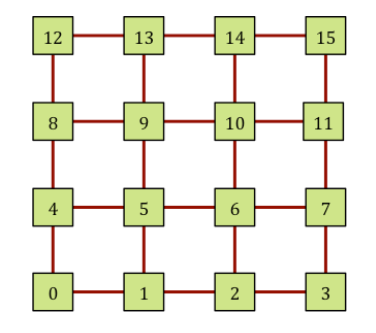
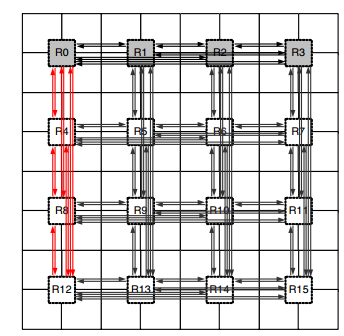
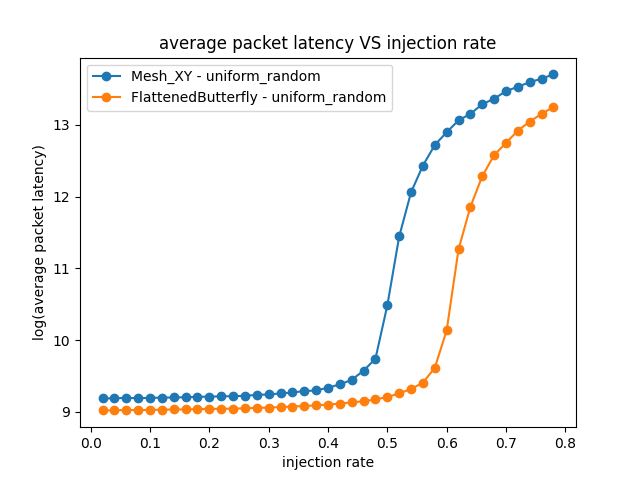
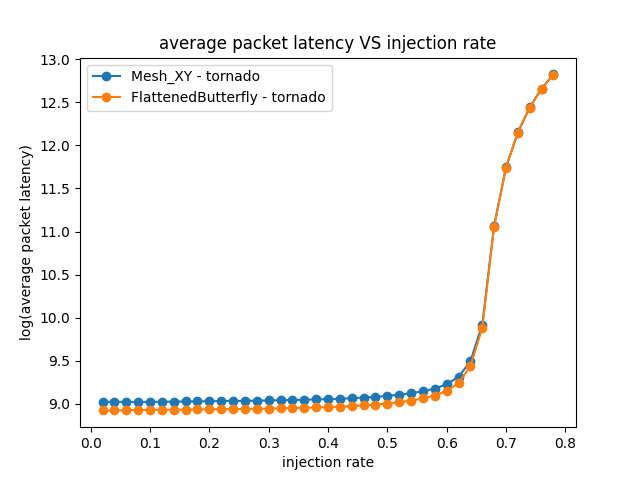
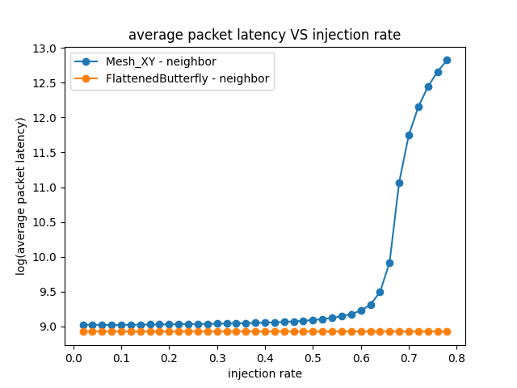

# Topology Comparison
- construct new topologis
- compare a Mesh (called Mesh_XY in Garnet), Flattened-Butterfly, for network performance
- design space exploration: run a suite of simulations for of these three topologies and plot the results

## Flattened Butterfly Topology
#### papers
- Kim et al., “Flattened Butterfly: A Cost-Efficient Topology for High-Radix Networks”,
ISCA 2007
- Kim et al., “Flattened Butterfly Topology for On-Chip Networks”, MICRO 2007

#### tips
- focus just on the topology (don’t worry about the routing and flow-control aspects discussed in the paper)
- do not need to implement the concentration factor (4 nodes connected to one Router) used in the paper(assume Garnet’s default one traffic injector per router)

#### steps
1. Create [FlattenedButterfly.py](./FlattenedButterfly.py) in `$gem5/configs/topologies`
    - take a look at `Mesh_XY.py` for reference
    - all links are uni-directional – i.e., we need to add links in both directions
    - notice a link weight of “1” on the x-links and “2” on the y-links for deadlock avoidance. use the same allocation in the topologies
    - the router ids used in Mesh_XY code follow the following numbering scheme (0 to 15)


    - the link of 4*4 Flattened-Butterfly is shown below(the routers within a row are fully connected, as are the routers
within a column)


2. print all the links that are created every time a simulation is run for debugging
3. testing: i.e. inject one (or more fixed number of) packet(s) into the network from a specific source to a specific destination
4. run this topology by specifying `--topology=FlattenedButterfly`

## Configuration
#### traffic description
- all packets are 64-bits wide: the number of flits in every packet = (packet_size / link width)
- run Uniform Random(`--synthetic=uniform_random`), Tornado(`--synthetic=tornado`) and Neighbor(`--synthetic=neighbor`) traffic pattern for all the designs; the details of each traffic pattern can be seen in `src/cpu/testers/garnet_synthetic_traffic/GarnetSyntheticTraffic.cc`
- start at a (packet) injection rate of 0.02, and keep incrementing in intervals of 0.02 till the network saturates

#### requirements
for each (configuration, traffic pattern) pair, plot the average packet latency vs. injection rate for both topologies on the same graph: Mesh and Flattened Butterfly

Sample run command is shown below:
```sh
./build/Garnet_standalone/gem5.opt configs/example/garnet_synth_traffic.py \
--network=garnet \
--num-cpus=16 \
--num-dirs=16 \
--topology=Mesh_XY \
--mesh-rows=4 \
--sim-cycles=5000000 \
--inj-vnet=0 \
--router-latency=2 \
--injectionrate=0.02 \
--synthetic=uniform_random \
--link-width-bits=32
```

## Analysis
run [lab2.sh](./scripts/lab2.sh) and save the fig (in [./results/](./results/))

### uniform_random


### tornado


### neighbor

